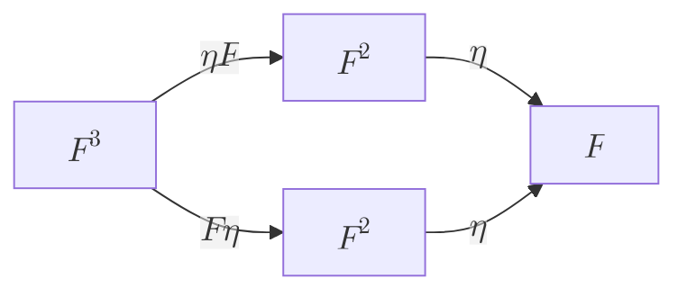

# What is monad

I've seen various introduction about monad, but none of them is clear enough for me to understand. So I decided to write my own introduction about monad.
To understand monad in programming is not difficult, but it is complex. We need to understand a lot of smaller concepts before we can understand monad.
So we are going top down from monad and expand to lower concepts.

## Monad in programming

What is monad in math, how to represent math in programming.

### represent monad in programming

Represent math(category theory) in programming we need to know [curry howard correspondence](). That is, a type in programming is a proposition in math, and a term for it in programming is a proof for the proposition in math. So we can represent math in programming by using type and term.

For a category `C`, Identity functor `I`, a monad is a triple $(F, \mu, \eta)$ where:

1. A functor $F : C \to C$.
2. A natural transformation unit $\mu : I \to F$
3. A natural transformation join $\eta : F^2 \to F$.

also we need them to meet some laws:

1. the unit law:

   ```mermaid
   graph LR;
       F1[$$F$$] -- $$\mu F$$ --> F21["$$F^2$$"]
       F1 -- $$F\mu$$ --> F22["$$F^2$$"]
       F21-- $$\eta$$ --> F2[$$F$$]
       F1 <-- $$id$$ --> F2
       F22-- $$\eta$$ --> F2
   ```

   where $\mu F$ is [right Whiskering](12) of $\eta$ and $F$, same goes for [left Whiskering]() for $F\mu$.
   $F \mu$ in haskell is `fmap unit` and $\mu F$ in haskell is `unit`.
   we have $\eta$ = $\eta F$ since we are in the same category `C`,
   Then we have the unit law: `join . fmap unit = join . unit`
   `[1,2,3]` -> `[[1],[2],[3]]` -> `[1,2,3]`
   `[1,2,3]` -> `[[1,2,3]]` -> `[1,2,3]`

2. the associativity law: $(F^2) o F = F o (F^2)$ that is `join . fmap join = join . join`



To represent it in programming, Haskell.
Haskell type system is powerful enough to represent some of the category theory concepts but limited to Hask(category of type in haskell).

1. A type constructor `F` in Haskell, where F is a second order type.
   * For any function `f :: a -> b`, `a, b` must be a one order type
2. A function `unit :: Identity a -> F a`,
3. A function `join :: F (F a) -> F a`

then we can represent monad in Haskell as:

```haskell
data Identity a = Identity a
type NaturalTransformation f g = forall a. f a -> g a
type Compose f g a = f (g a)
class Monad m where
  unit :: NaturalTransformation Identity m
  join :: NaturalTransformation (Compose m m) m
```

then we can simplify it to the following, since `Identity a` is the same as `a`, and `Compose m m a` is the same as `m (m a)` by the concept of isomorphism.

```haskell
class Monad m where
  unit :: a -> m a
  join :: m (m a) -> m a
```

## Monad in math
